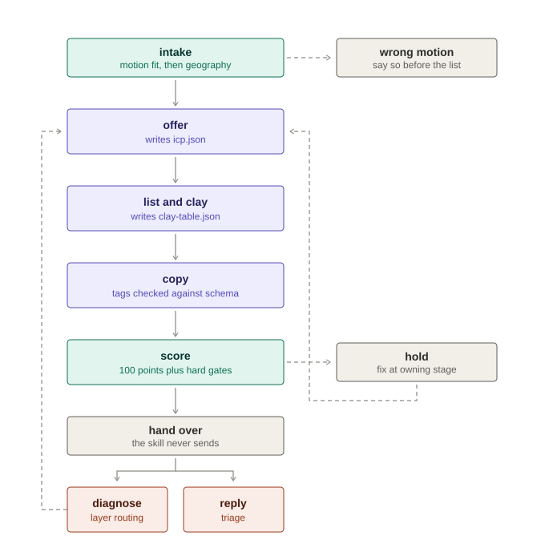
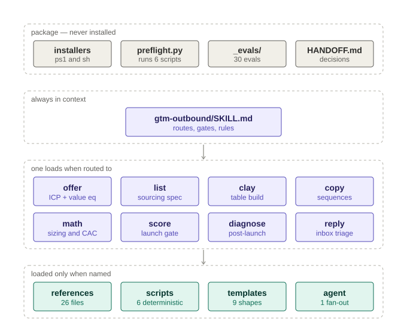

# gtm-outbound

**Nine Claude Code skills that engineer B2B cold-outbound campaigns end to end** — from
"who should I even target" to "why did my reply rate die" — with zero dependencies and a
hard rule that the skill never sends anything itself.

<p align="center">
  
</p>

Every box writes a file the next box validates against: `offer` writes `icp.json`,
`list` writes `clay-table.json`, `copy` validates its merge tags against that schema.
A merge tag can never reference a field the pipeline does not produce.

## Who this is for

| It's for you if… | It's not for you if… |
|---|---|
| You run cold outbound (or want to) with Clay + Smartlead/Instantly | You want consumer email marketing to opted-in lists — different mechanics, different law |
| You're a founder, SDR lead, or agency engineering campaigns for clients | You want an AI that hits "send" for you — this skill refuses, by design |
| You want numbers from a script, not vibes from a chatbot | Your buyers don't know they have the problem yet — that's content, not cold email |
| You care about compliance before the list exists, not after the fine | You want to evade spam filters — out of scope, permanently |

The first intake question is whether outbound is even the right motion for your ACV and
market. Sometimes the best campaign is the one the skill talks you out of.

## How you work it

Talk to it like a colleague. Three entry points cover everything:

| Where you are | What you type |
|---|---|
| Starting from nothing | `/gtm-outbound` — it asks one question and routes |
| Have a campaign running badly | `/gtm-outbound diagnose export.csv` |
| Just want a number (list size, CAC, sample size) | `/gtm-outbound math` |

<p align="center">
  
</p>

The full chain — `/gtm-outbound full` — runs `offer → list → copy` in order and scores
the result. Each stage's artifact feeds the next, and `score` gates the launch with hard
gates that fail the campaign regardless of total score. Once it's live, `diagnose` and
`reply` bring you back.

## Install

```bash
git clone https://github.com/MostaDaoud/gtm-outbound.git
cd gtm-outbound
python preflight.py        # verifies Python, runs every script, checks a calculation
./install.sh               # or: pwsh -File install.ps1
```

Restart Claude Code, then type `/gtm-outbound math`. If it responds, you're done.

Requirements: Claude Code, Python 3.10+, nothing else — **no pip install, no API keys,
no network**. Everything runs locally on files you provide. Full details:
[INSTALL.md](INSTALL.md).

## What's inside

```
9 skills · 1 research agent · 26 reference files · 6 scripts · 9 templates
```

- **Deterministic scripts, not prose math** — `gtm_math.py` (sizing, CAC, payback,
  A/B significance), `diagnose_campaign.py` (layer-routed failure diagnosis),
  `validate_spintax.py`, `score_message.py`, `clay_taxonomy.py`, `reply_classify.py`
- **2026-current deliverability** — tri-provider bulk-sender rules (Google/Yahoo,
  Microsoft's `550 5.7.515` rejections, Apple iCloud), warmup risk caveats, open rate
  demoted to trend-only
- **Compliance before the list exists** — jurisdiction → consent model → required
  artifacts, covering GDPR/PECR/CAN-SPAM/CASL and Saudi PDPL
- **30 evals + collision tooling** — `python _evals/collision_check.py --installed
  ~/.claude/skills --candidate .` measures whether these skills fight yours for prompts

## Design rules

- **The skill never sends.** It produces configurations and drafts; a human transmits.
- **All arithmetic goes through the scripts.** A wrong list size looks exactly as
  plausible as a right one.
- **Numbers are defaults, not laws** — every threshold is a calibrated starting point;
  replace them with your data as it accumulates.
- **Frameworks are re-expressed, sources credited inline** — no source text is
  reproduced, and dated provenance notes (`checked 2026-09-09`) mark every external
  claim.

## License

[MIT](LICENSE)
